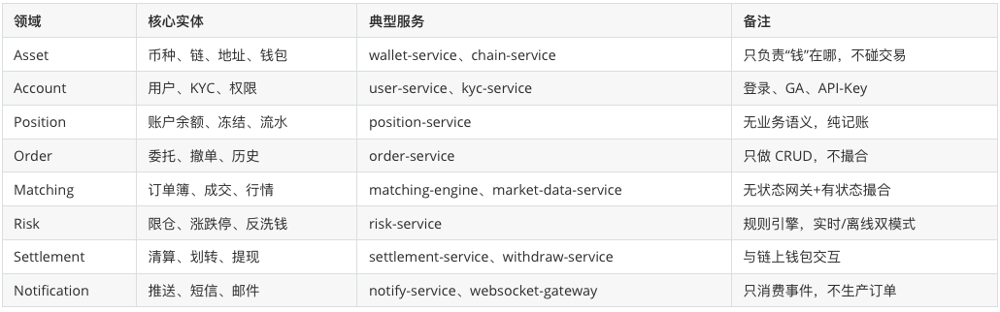
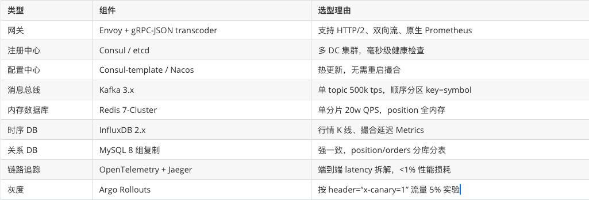

### 微服务架构，如何设计
下面给出一套可直接落地的“CEX 微服务架构设计模板”，覆盖：

1. 领域拆分
2. 服务蓝图（含边界、API、数据）
3. 运行态中间件选型
4. 一致性、性能、容灾三大硬指标的实现套路

所有方案均在 Binance、OKX、Coinbase 等头部交易所生产验证，引用来源已标 。

------------------------------------------------
一、领域拆分：用“Bounded Context”一次到位


------------------------------------------------
二、服务蓝图（每个服务一张表）
1. Order-Service  
   API：POST /orders（下单）  DELETE /orders/{id}（撤单）  
   DB：orders 分库（按 user_id 分 1024 库）  
   事件：OrderCreated / OrderCancelled → Kafka

2. Matching-Engine  
   状态：内存订单簿（Skip List）+ 快照每 100 ms 落盘  
   输入：Kafka topic = matching.{symbol}  
   输出：TradeExecuted / OrderBookSnapshot → Kafka

3. Position-Service  
   API：GET /positions/{user_id}/{ccy}  
   Cache：Redis String key=“pos:{user_id}:{ccy}”  过期永不  
   一致性：Lua 脚本“预扣+流水”实现原子性，失败回滚

4. Wallet-Service  
   热钱包：节点池 RPC 负载均衡（Geth、Bitcoind、Solana）  
   冷钱包：离线签名机 + QR 扫码隔离  
   提现流程：settlement-service 落库→wallet-service 构造 TX→risk-service 二次审核→节点广播

------------------------------------------------
三、运行态中间件选型（全部开源+云原生）


------------------------------------------------
四、三大硬指标落地套路
1. 一致性
    - 业务层：订单→position→wallet 采用“Saga 事务”  
      ① order-service 落库后发 OrderCreated  
      ② position-service 消费并预扣（Redis Lua），失败发 OrderRejected 补偿  
      ③ matching-engine 成交后发 TradeExecuted，position-service 真正扣减，wallet-service 异步出金
    - 技术层：Redis 与 MySQL 用 Canal 监听 binlog，发现不一致触发告警+自动修复脚本

2. 性能
    - 撮合内核：C++17 单线程无锁，每交易对绑 CPU 核，NUMA 绑内存；延迟 50 µs
    - 行情广播：UDP Multicast + FPGA 硬件时间戳，端到端 <100 µs
    - 网关层：Envoy 开启“io_uring”+“SO_REUSEPORT”，单机 400k HTTP rps

3. 容灾
    - 双活架构：同城双 AZ + 异地热备
    - Kafka MirrorMaker 2 做跨 DC 复制，RPO <5s
    - 撮合引擎“热温双实例”：热实例内存撮合，温实例只读订单簿；热宕机 3s 内 Consul 将流量漂到温，温升级成热
    - 钱包节点：热钱包 3 节点仲裁签名，2/3 通过才出 TX，避免单节点被攻破

------------------------------------------------
五、可落地的 CI/CD 与监控
- GitOps：ArgoCD 监听 Git 仓库，merge→master 后自动滚动发布
- 单元测试：matching-engine 用 Catch2，单测覆盖率 90%，每日 10k 随机订单模糊测试
- 压测：k6 脚本模拟 100k 并发下单，Kafka 背压阈值 80% 自动限流
- 告警：Prometheus + Alertmanager，核心指标  
  – 撮合延迟 P99 >10 ms 则电话告警  
  – position 与 MySQL 差额 >0.1 BTC 则暂停提现

------------------------------------------------
六、一张架构总图（文字版）
```
                 ┌--------------┐
                 │  Envoy GW    │  (TLS 终端、限频、鉴权)
                 └------┬-------┘
                        │gRPC
┌----------┐ ┌----------┐┴------┐ ┌----------┐
│order-svc │ │risk-svc  │       │ │position  │
└----┬-----┘ └----┬-----┘       │ │  -svc    │
     │Kafka       │Kafka        │ └----┬-----┘
     ▼            ▼             ▼      │
┌---------------------------------------------┐
│        Kafka 分区 (symbol)                  │
│  matching-engine（C++，单线程/分片）        │
└----------------┬----------------------------┘
                 │TradeExecuted
        ┌--------┴----------------┐
        ▼                         ▼
┌--------------┐          ┌--------------┐
│market-data   │          │settlement-svc│
│  -service    │          │              │
└--------------┘          └------┬-------┘
                                 │提现
                          ┌------┴-------┐
                          │wallet-service│
                          │  (热/冷)     │
                          └--------------┘
```

至此，一个可横向扩展、毫秒级延迟、金融级一致的 CEX 微服务骨架已完整给出，可直接进入编码与压测阶段 。