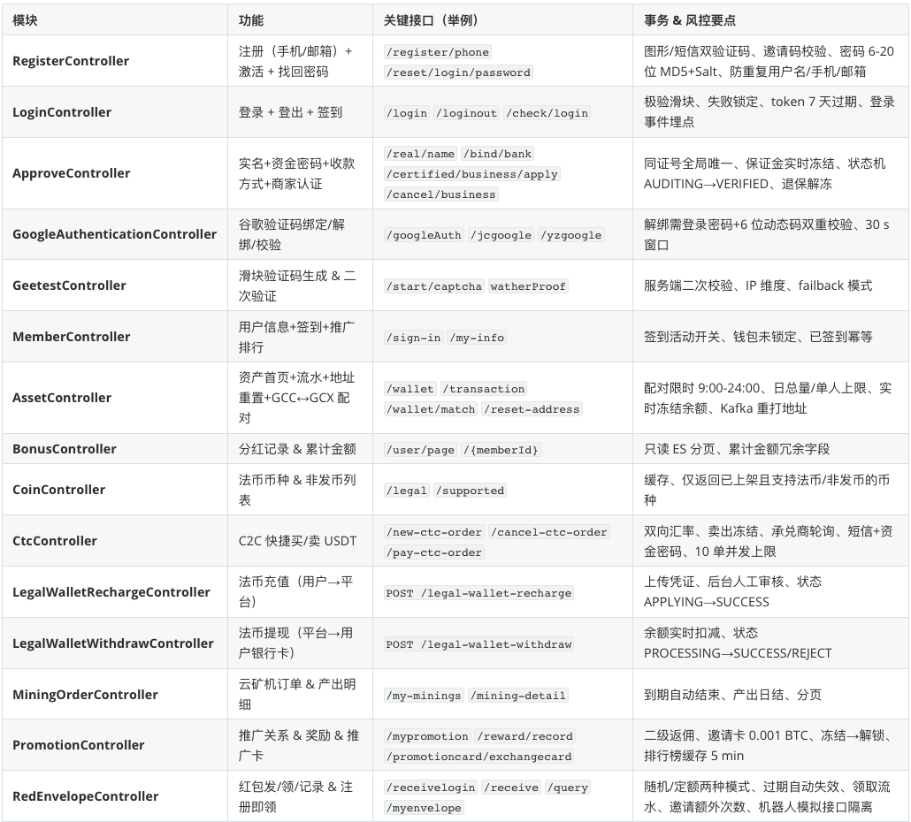

CtcController 做的是 “用户⇋用户（C2C）场外买/卖 USDT”，平台只撮合+冻结，人民币线下流转。

LegalWalletRechargeController 做的是 “用户⇋平台官方钱包入金”，直接给平台账号打款，后台审核后把币/额度划到用户账户。

ActivityController 是 “平台运营活动统一入口”，一句话： 用户用指定币种参与各类营销/认购/锁仓活动，平台根据规则冻结或扣币，并生成活动订单（ActivityOrder）作为未来分红、空投、矿机发放的唯一凭证。

AideController 是 “全站公共辅助数据大管家”，一句话概括：
给 App/Web 提供不依赖登录的通用配置、公告、帮助、广告、版本升级等静态/半静态数据，同时用 Redis 做多级缓存，支撑首页、帮助中心、启动页等高频只读场景。

AnnouncementController 核心职责：
“交易所公告/新闻的只读出口”——给前端提供 分页列表、单条详情、上下篇导航 3 个纯查询接口，全部带多语言（lang）过滤 + Redis 缓存，支撑 App/Web 首页弹窗、公告中心、详情页 3 大场景。

ApproveController 是 “用户安全与认证中心” 的核心入口，一句话：
负责所有 C 端用户的“身份+资金+收款方式”全生命周期认证，包括实名、资金密码、手机/邮箱、银行卡/支付宝/微信、商家认证及保证金冻结/退还

SmsController 负责所有短信验证码；

TransferController 做站内链上转账；

WithdrawController 做对外链上提币；

LegalWalletRecharge/LegalWalletWithdrawController 做法币充值与提现；

UploadController 提供实名/凭证图片上传。

