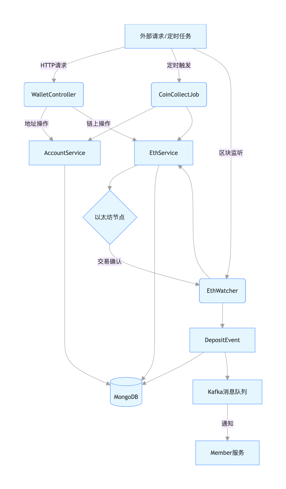

# 项目文件功能分析与业务流程

## 1. 文件功能与作用分析

### 核心配置文件

| 文件路径 | 主要功能 | 项目作用 |
|---------|---------|---------|
| `src/main/resources/logback-spring.xml` <br> `target/classes/logback-spring.xml` | 日志配置文件，定义了：<br>- 控制台输出格式<br>- 按天滚动的文件日志存储（`./logs/eth/日期/日志文件`）<br>- 日志级别为INFO | 统一日志管理，确保系统运行状态可追踪，同时按日期归档便于问题排查 |
| `src/main/resources/application.properties` <br> `target/classes/application.properties` | 系统核心配置：<br>- 服务端口（7003）、上下文路径（/eth）<br>- Eureka注册中心地址<br>- MongoDB连接信息<br>- Kafka配置<br>- 以太坊节点RPC地址、钱包路径、初始区块高度等 | 集中管理系统参数，通过配置调整系统行为，无需修改代码即可变更服务属性 |
| `.gitignore` | 定义Git忽略文件：<br>- target目录（编译产物）<br>- IDE配置文件（.idea、.iml）<br>- 系统文件（.DS_Store） | 确保版本控制只跟踪源代码，避免编译产物和本地配置污染代码库 |
| `pom.xml` | Maven依赖管理：<br>- 父项目继承（wallet-rpc）<br>- Spring Boot核心组件<br>- 区块链相关（web3j）<br>- 数据存储（mongodb）<br>- 服务注册（eureka）<br>- 消息队列（kafka） | 管理项目依赖，定义构建规则，确保开发环境一致性 |

### 核心Java代码

| 文件路径 | 主要功能 | 项目作用 |
|---------|---------|---------|
| `EthWalletApplication.java` | 应用程序入口：<br>- 标注`@SpringBootApplication`启动Spring上下文<br>- `@EnableEurekaClient`注册服务到注册中心<br>- `@EnableScheduling`开启定时任务支持 | 启动整个微服务，初始化所有组件并注册到服务发现中心 |
| `CorsConfig.java` | 跨域配置：<br>- 注册CORS过滤器<br>- 允许所有来源、方法、头部的跨域请求 | 解决前端调用后端接口时的跨域问题，保障前后端通信 |
| `WalletController.java` | 提供REST接口：<br>- 区块高度查询<br>- 地址生成与查询<br>- 矿工费计算<br>- 转账/提现操作<br>- 余额查询<br>- 手动同步区块 | 作为对外服务接口层，接收外部请求并转发给业务层处理 |
| `EthWatcher.java` | 区块监听服务：<br>- 扫描以太坊区块并解析交易<br>- 发现入金交易后触发存款事件<br>- 同步地址余额<br>- 支持手动触发区块同步 | 实时监听链上交易，确保系统与区块链状态一致，是入金处理的核心 |
| `CoinCollectJob.java` | 定时任务：<br>- 每天17:00执行<br>- 批量查询地址余额并更新到数据库<br>- 使用AccountReplay进行分页处理 | 作为区块监听的兜底机制，定期校对余额，防止漏单 |
| `keystore/UTC--...json` | 以太坊钱包密钥文件：<br>- 包含加密的私钥信息<br>- 用于签名交易 | 存储系统钱包的密钥信息，是转账和提现的身份凭证 |

## 2. 组件协作关系

各组件通过Spring容器管理，形成以下协作关系：

1. **启动流程**：
    - `EthWalletApplication`启动时，自动加载`CorsConfig`配置跨域过滤器
    - 初始化`EthWatcher`和`CoinCollectJob`等定时任务组件
    - 注册服务到Eureka，连接MongoDB和Kafka

2. **核心业务协作**：
    - **入金处理**：`EthWatcher`实时扫描区块→发现有效交易→触发`DepositEvent`→`EthService`更新余额→发送Kafka通知
    - **出金处理**：`WalletController`接收提现请求→`EthService`使用keystore签名交易→发送到以太坊节点
    - **余额校对**：`CoinCollectJob`定时调用`AccountService`和`EthService`→全量比对链上与数据库余额

3. **数据流向**：
    - 外部请求→`WalletController`→业务服务（`EthService`/`AccountService`）→数据库或区块链
    - 区块链事件→`EthWatcher`→业务服务→数据库+Kafka消息

## 3. 业务流程图


```

### 关键流程说明

1. **地址生成流程**：
   ```
   客户端请求 → WalletController → EthService生成地址 → AccountService保存 → 发送Kafka通知
   ```

2. **入金处理流程**：
   ```
   以太坊区块生成 → EthWatcher扫描 → 发现有效交易 → 触发DepositEvent → 
   更新数据库余额 → 发送Kafka通知前端
   ```

3. **提现处理流程**：
   ```
   客户端请求 → WalletController → EthService验证余额 → 
   使用keystore签名交易 → 发送到以太坊节点 → 返回交易哈希
   ```

4. **余额校对流程**：
   ```
   定时任务触发 → CoinCollectJob分页查询地址 → 
   EthService查询链上余额 → AccountService更新数据库
   ```

通过以上组件的协同工作，系统实现了以太坊钱包的核心功能，包括地址管理、余额查询、转账提现、交易监听等，同时通过定时任务和实时监听双重机制保证了数据的准确性。